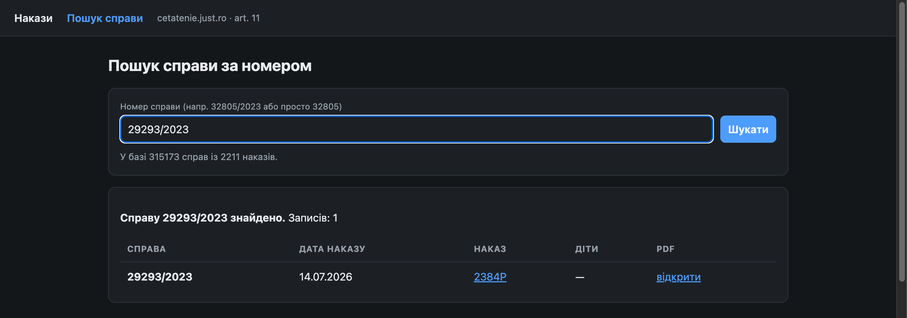
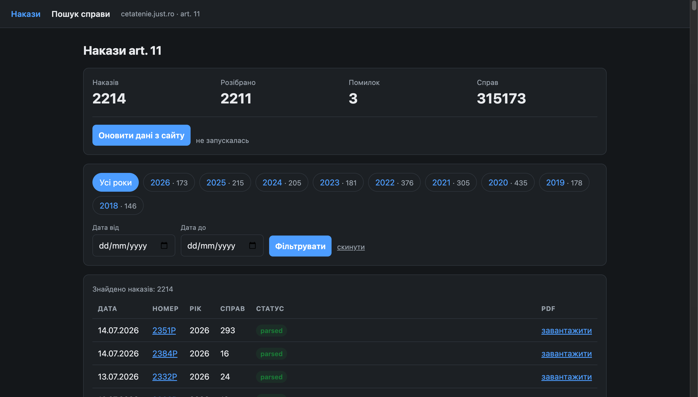

<div align="center">

# dosar-radar

**Find your case in the Romanian citizenship orders — in one search box.**

A self-hosted search index over every *art. 11* order published by the Romanian
Ministry of Justice: **315,173 case numbers** extracted from **2,214 PDF orders** covering
2018–2026 — as of July 2026, and growing with every sync.

🇬🇧 English · [🇺🇦 Українська](README.uk.md)

[](https://www.python.org/)
[](https://flask.palletsprojects.com/)
[](https://www.sqlite.org/)
[](https://docs.docker.com/compose/)
[](LICENSE)



</div>

---

## The problem

If you have applied for Romanian citizenship under **article 11**, the decision on your
file is published on [cetatenie.just.ro](https://cetatenie.just.ro/ordine-articolul-1-1/)
— as a **PDF attached to a ministerial order**. There is no search. There is no index.
There is no notification.

There are over two thousand such PDFs. To find out whether your case number appears in
any of them, you are expected to open them one by one and read.

`dosar-radar` does that once, and turns it into a search box.

## What it does

| | |
|---|---|
| 🔎 **Search by case number** | `29293/2023`, `48031/RD/2023`, or just `29293` — all find the same file |
| 📄 **Full order index** | Every order with date, number, case count and a link to the original PDF |
| 🗂 **Per-order case lists** | Open any order and see every case number printed in it |
| 🔄 **Keeps itself current** | Re-syncs every 3 hours on its own, parsing only what is new |
| 🖥 **CLI** | Same search and sync without the web UI — useful in scripts and cron |
| 🐳 **Docker-first** | `make up` and you have it; data lives in a named volume |

<div align="center">

</div>

## Quick start

```bash
git clone https://github.com/paulfcdd/dosar-radar.git
```

```bash
cd dosar-radar && make up
```

The UI is on **http://localhost:8000** — but the database starts empty. Fill it:

```bash
make sync
```

The first sync downloads and parses ~2,200 PDFs. Depending on your connection this takes
roughly **20–40 minutes**; every later run only touches orders that are new or previously
failed, so it finishes in seconds. Watch progress in the web UI or in `make logs`.

Want to check the setup works before committing to a full sync?

```bash
make sync-fast
```

That parses only the 20 most recent orders.

## How it works

```
cetatenie.just.ro
       │
       │  ① HTTP session that solves the site's proof-of-work challenge
       ▼
  index page ──② parse HTML──▶ 2,214 orders (date, number, PDF url)
       │
       │  ③ download PDFs, 4 in parallel
       ▼
   pdfplumber ──④ regex + noise filter──▶ 315,173 case numbers
       │
       ▼
    SQLite (WAL) ──▶ Flask UI  ·  CLI
```

Four parts are worth a closer look.

**① The challenge.** The ministry's site sits behind an anti-bot page that answers `503`
with a JavaScript puzzle instead of content. It is a hashcash-style proof of work: the page
carries a hex token `c`, and the client must find a counter `i` such that `SHA1(c + str(i))`
has the byte `0xb0` at position `n` and `0x0b` at `n+1`, where `n` is the first hex digit of
the token. The answer goes back as a cookie. [`session.py`](cetatenie/session.py) solves it in
pure Python and caches the cookie for the rest of the run — no browser, no JS engine.

The obfuscated script rotates its string array by a different amount on every response, so
positional parsing breaks within a day. Roles are resolved **by content** instead: the
40-char hex string is the token, the string ending in `=` is the cookie prefix.

**② The index.** Orders are grouped under plain `<p>` year headings rather than nested
markup, so [`scraper.py`](cetatenie/scraper.py) walks `<p>`/`<li>` nodes in order and carries
the current year forward as state.

**③ Parsing.** PDFs are parsed with `pdfplumber`. The tricky part is that a bare regex for
`number/year` also matches legal references in the headers and footers — `Regulament 2016/679`,
`Legea 21/1991` — which are not case numbers. A noise filter drops those lines before
extraction.

**④ Search keys.** Case numbers appear in two shapes: `16545/2024` and `48031/RD/2023`.
Each case is stored twice — as printed (`case_number`) and normalised to `number/year`
(`search_key`) — so `48031/2023` finds the `RD` variant too, and a bare `29293` matches
every year.

## CLI

```bash
make search Q=29293/2023
```

```bash
make stats
```

Or directly, inside the container or a local virtualenv:

```bash
python cli.py sync --workers 8 --limit 50
```

```bash
python cli.py search 48031/2023
```

## Make targets

Run `make` with no arguments for this list at any time.

| | |
|---|---|
| **Docker** | |
| `make build` | Build the image |
| `make up` | Start the web UI on :8000 |
| `make down` | Stop (the volume and its data survive) |
| `make logs` | Follow logs |
| `make sh` | Shell inside the container |
| **Data** | |
| `make sync` | Full sync — index + all unparsed PDFs |
| `make sync-fast` | Trial run on 20 orders |
| `make sync-retry` | Sync, ignoring retry backoff |
| `make stats` | Orders and cases in the database |
| `make search Q=…` | Look up a case number |
| `make db-export` | Snapshot the volume's database to `./data.sqlite3` |
| `make db-import` | Load `./data.sqlite3` into the volume |
| `make clean` | Remove containers **and** the database volume |
| **Without Docker** | |
| `make venv` | Create `.venv` and install dependencies |
| `make dev` | Run Flask locally |

Variables: `PORT` (default `8000`), `WORKERS` (default `4`), `Q` for `make search`.

### Moving the database between machines

A synced database is ~36 MB and is deliberately **not** in git. To avoid re-syncing from
scratch elsewhere, move the file:

```bash
make db-export && scp data.sqlite3 other-host:/path/dosar-radar/
```

Then `make db-import` on the other side. Both targets go through `VACUUM INTO` and clean up
stale WAL files, because copying a live SQLite database by hand silently loses — or reverts —
recent writes.

## Configuration

| Variable | Default | Meaning |
|---|---|---|
| `CETATENIE_DB` | `./data.sqlite3` (`/data/data.sqlite3` in Docker) | Database path |
| `PORT` | `8000` | Host port published by compose |
| `BIND` | `127.0.0.1` | Interface compose binds to. Behind a reverse proxy leave it alone; set `0.0.0.0` only if you really want the app exposed directly |
| `SYNC_INTERVAL_HOURS` | `3` | How often the built-in scheduler re-syncs |
| `SYNC_ENABLED` | `1` | Set to `0` to disable automatic syncing entirely |

### Syncing

A background thread in the web process re-syncs every `SYNC_INTERVAL_HOURS`, with a couple of
minutes of jitter so it does not hit the ministry exactly on the hour. The last run is
persisted, so restarting the container does not reset the schedule or trigger a stampede.

There is **no HTTP endpoint to trigger a sync**. The service is meant to be public, and an
unauthenticated trigger would let anyone use your server to hammer a government site. Manual
runs go through the CLI:

```bash
make sync
```

Both paths take an exclusive `flock` on the data volume, so a manual run and a scheduled one
can never overlap — whichever is second exits immediately.

**Failed orders back off.** Three orders have been dead on the ministry's own site for years;
retrying them every three hours costs a 60-second timeout each and fills the logs with alarming
errors from a perfectly healthy service. Retries are spaced out instead — 1h, 6h, 24h, 72h, then
weekly. To ignore the backoff and retry everything now:

```bash
make sync-retry
```

The container runs `gunicorn` with **one worker and eight threads** on purpose: background
sync progress is held in process memory, so with several workers `/sync/status` would answer
sometimes from the process doing the downloading and sometimes from one that knows nothing
about it.

## Project layout

```
app.py                 Flask routes — index, search, order, sync
cli.py                 Command-line interface
cetatenie/
  session.py           HTTP session + proof-of-work challenge solver
  scraper.py           HTML index parser + PDF case extractor
  db.py                SQLite schema and queries
  sync.py              Orchestration, thread pool, progress state
templates/             Server-rendered UI, no build step, no JS framework
```

No frontend toolchain, no ORM, no migrations — about 600 lines of Python in total.

## Limitations, honestly

- **This is not an official source.** The authoritative answer is always the PDF on
  cetatenie.just.ro, which this tool links to for every result. Numbers are extracted by
  regex from documents that were never meant to be machine-read.
- **3 of 2,214 orders do not parse.** The ministry's own index links to three PDFs that
  return `404`. They are marked `error` in the UI, with the reason shown.
- **Scanned PDFs would be missed.** Orders without a text layer are flagged rather than
  silently returning zero cases. None are currently in that state, but the check exists.
- **Be a good citizen.** Sync is manual and defaults to 4 parallel downloads. Please do not
  crank `WORKERS` up and hammer a public ministry's site.

## License

[MIT](LICENSE). Not affiliated with, endorsed by, or connected to the Ministry of Justice of
Romania. All order data belongs to its publisher and is linked, not republished.
